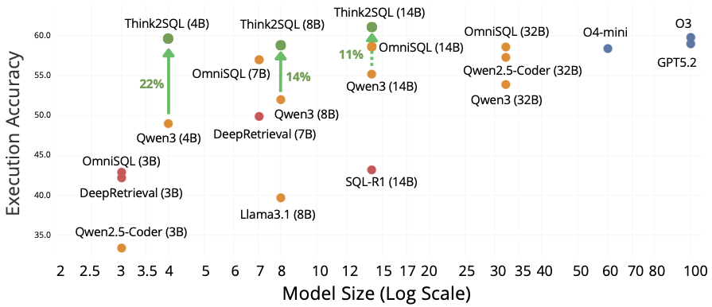

<div align="center">
<h1>Think2SQL: Blueprinting Reward Density and Advantage Scaling for Effective Text-to-SQL Reasoning</h1>
</div>

</div>


<div align="center" style="display: flex; gap: 5px; justify-content: center;">
<a href=""></a>
<a href=""></a>
<a href="https://huggingface.co/anonymous-2321"></a>
</div>
<br>


## 📖 Overview
Think2SQL is a systematic study on injecting reasoning capabilities into Text-to-SQL through Reinforcement Learning with Verifiable Rewards (RLVR). We uncover the critical interplay between reward density, advantage scaling, and model capacity, proposing novel execution-guided dense rewards and optimal scaling strategies. Our 4B-parameter model achieves reasoning capabilities competitive with state-of-the-art models, while providing a comprehensive analysis for optimizing Text-to-SQL reasoning under computational constraints.

**Key Contributions:**
- Execution-guided dense reward function that outperforms binary signals
- Analysis of advantage scaling mechanics for models of different sizes
- Evaluation of cold start effects and supervised fine-tuning impact
- Pareto frontier mapping for training efficiency optimization

<div align="center">

<p align="center">
Figure 1: Execution vs. model size (log scale) for various open- and closed- models on the BIRD-Dev set.
</p>

</div>


## 📚 Citations

## 🤖 Model Weights and distilled dataset

We are excited to release our Think2SQL model weights along with the Gemini3-Flash distilled dataset!


| Model  | Size | HuggingFace Link | License
|-------------|-------------|------|------|
| Think2SQL (4B) | 4B | [🤗 https://huggingface.co/anonymous-2321/Think2SQL-4B](https://huggingface.co/anonymous-2321/Think2SQL-4B)  | [Apache 2.0 ](https://www.apache.org/licenses/LICENSE-2.0)
| Think2SQL (8B) | 8B | [🤗 https://huggingface.co/anonymous-2321/Think2SQL-8B](https://huggingface.co/anonymous-2321/Think2SQL-8B)  | [Apache 2.0](https://www.apache.org/licenses/LICENSE-2.0) 
| Think2SQL (14B) | 14B | [🤗 https://huggingface.co/anonymous-2321/Think2SQL-14B](https://huggingface.co/anonymous-2321/Think2SQL-14B) | [Apache 2.0](https://www.apache.org/licenses/LICENSE-2.0) 

| Name  | Source | HuggingFace Link | License
|-------------|-------------|------|------|
| Distilled-SFT | Gemini3-Flash  | [🤗 https://huggingface.co/datasets/anonymous-2321/bird-train-gemini3-flash](https://huggingface.co/datasets/anonymous-2321/bird-train-gemini3-flash) | [Gemini API Terms of Service](https://ai.google.dev/gemini-api/terms)


## 📑 Documentation Structure

This repository is organized as follows:

```
Think2SQL/
├── 📁 .devcontainer/                 # Dockerfile and devcontainer config        
├── 📁 config/                        # Base configes for Accelerate and Training scripts 
├── 📁 prompts/                       # Training and Inference jinja file prompts 
├── 📁 scripts/                       # Training and Inference bash files 
│   ├── 📁 evaluation_scripts/        # Eval bash files with hyperparameters 
│   ├── 📁 slurm/                     # Slurm GRPO training bash files
│   ├── 📁 utils/                     # Bash utils
│   ├── 📄 evaluate.sh                # Evaluate launcher bash file 
│   ├── 📄 grpo.sh                    # GRPO train launcher bash file
│   ├── 📄 sft.sh                     # SFT train launcher bash file
│   └── 📄 submit_and_log.sh          # General launcher for reproducibility
├── 📁 src/think2sql                  # Source code
│   ├── 📁 data_processor/            # Eval bash files with hyperparameters 
│   ├── 📁 evaluate/                  # Slurm GRPO training bash files
│   ├── 📁 grpo/                      # RLVR trainer with main launcher
|   │   ├── 📁 rewards/               # RLVR Rewards implementation 
|   │   ├── 📄 main_rl.py             # RLVR main launcher
|   │   └── 📄 think2sql_trainer.py   # RLVR trainer   
│   ├── 📁 sft/                       # SFT trainer with main launcher
│   ├── 📁 utils/                     # Code utils 
│   ├── 📄 configs.py                 # Dataclasses for script/model parameters
│   └── 📄 logger.py                  # Custom logger based on loguru 
├── 📄 pyproject.toml                 # UV toml requirements
├── 📄 train_wrong_queries.json       # BIRD train unexecutable queries
└── 📄 uv.lock                        # UV lock file
```


## 🛠️ Environment Setup
Before getting started, make sure your computing environment supports the following settings:
- Environment: Python 3.9+
- CUDA Version: 12.0+ (for vllm integration)
- devcontainer (for Docker interactions)
- GPU Prerequisites: 8 x 80GB+ GPU (for training) / 2 x 40GB GPU (for inference)

### Installation

1. Clone the repository:
```bash
git clone https://github.com/spapicchio/Think2SQL.git
cd Think2SQL
```

2. Rebuild container:
```
> Dev containers: Rebuild Container
```

3. Install dependencies:
```bash
uv sync --frozen
```

## 🚀 Quick Start

For reproducibility across both SLURM and local environments, we provide a general launcher script: [submit_and_log.sh](scripts/submit_and_log.sh). Use this for all training and inference tasks.
> - Before launching the job, it copies and then launches the file storing it in: ```bash ${BASE_WORK}/scripts/launched/${DATE_DIR}```  
> - Store the log file in ```bash "${BASE_WORK}/scripts/launched/${DATE_DIR}/${TIME_TAG}-${SLURM_JOB_ID}.sh""```

To use the script you can run for SLURM ENV:
```bash
./scripts/submit_and_log.sh  scripts/slurm/train_grpo_multi_node.sh <your job name>
```
in NO SLURM env
```bash
./scripts/submit_and_log.sh  scripts/grpo.sh 
```

The parameters of the scripts and models are available in:
```
├── 📁 scripts/                               # Training and Inference bash files 
│   ├── 📁 evaluation_scripts/                # Eval bash files with hyperparameters 
|   │   ├── 📄 evaluate_arctic_sql.sh         # Hyperparameters for Arctic-SQL 
|   │   ├── 📄 evaluate_deepretrieval.sh      # Hyperparameters for DeepRetrieval 
|   │   ├── 📄 evaluate_instruct_model.sh     # Hyperparameters for General purpose model 
|   │   ├── 📄 evaluate_qwen_3_no_think.sh    # Hyperparameters Qwen3 No_Thinking 
|   │   ├── 📄 evaluate_qwen_3_think.sh       # Hyperparameters Qwen3 Thinking 
|   │   ├── 📄 evaluate_sql_r1.sh             # Hyperparameters for SQL-R1 
|   │   └── 📄 evaluate_think2sql.sh          # Hyperparameters for Think2SQL
│   ├── 📁 slurm/                             # Slurm RLVR training bash files
|   |   ├── 📄 train_grpo_multi_node.sh       # SLURM RLVR multi-nodes 
|   │   └── 📄 train_grpo.sh                  # SLURM RLVR single-node
│   ├── 📄 evaluate.sh                        # Evaluate launcher bash file 
│   ├── 📄 grpo.sh                            # GRPO train launcher bash file
│   ├── 📄 sft.sh                             # SFT train launcher bash file
│   └── 📄 submit_and_log.sh                  # General launcher for reproducibility
```
## Thanks for
We thank [OmniSQL](https://github.com/RUCKBReasoning/OmniSQL) for the pre-processed datasets.